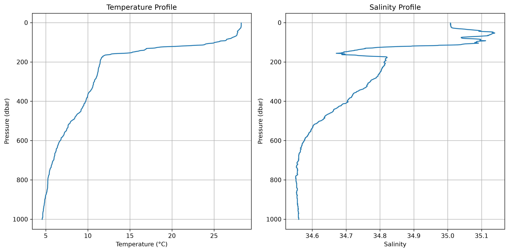

# Oceanographic Temperature & Salinity Profile Analysis

## Overview

This project analyzes a publicly available NOAA oceanographic CTD profile using Python in a Linux/WSL environment.

The analysis examines how temperature and salinity vary with pressure through the sampled ocean water column.

## Dataset

The dataset is a CTD profile from NOAA's National Data Buoy Center (NDBC).

- Platform: TAO mooring
- Site: KA-09-01
- Location: 2.02°N, 155°W
- Date: 11 May 2009
- Measurement type: CTD
- Data format: NetCDF

The dataset contains pressure, temperature, and salinity measurements.

## Methodology

1. Load the NOAA NetCDF dataset using `xarray`.
2. Extract pressure, temperature, and salinity variables.
3. Analyze the vertical profiles.
4. Plot temperature and salinity against pressure using Matplotlib.
5. Save the resulting visualization as a high-resolution PNG.

## Results

The generated profiles show how physical water properties change with increasing pressure through the sampled water column.



## Technologies

- Python
- xarray
- NumPy
- Matplotlib
- NetCDF
- Linux / WSL2

## Project Structure

```text
ocean-profile/
├── data/
│   └── profile.nc
├── figures/
│   └── ocean_profile.png
├── src/
│   └── plot_profile.py
├── requirements.txt
├── .gitignore
└── README.md
